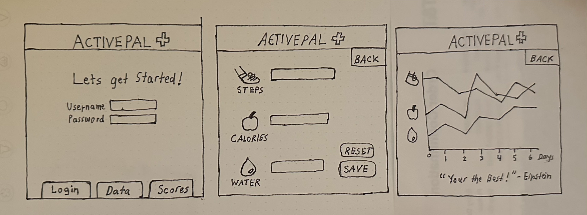

# Fitness Tracker
## Specification Deliverable
### Elevator pitch
Have you been looking for a good reason to exercise and accomplish your health goals? The new Fitness Tracker makes it easy for users to record their daily steps and calories. As users record their numbers daily, users will see a simple graphic of their progress as well as a daily motivational quote! This simple tracker makes it fun and easy for users to see their progress while achieving their health goals.
### Design

### Key Features
- Secure User Login
- Display of 2 fitness metrics.
- Ability to enter personal health data
- Inputs entered are recorded over time
- Display of their data on a simple easy-to-read graph(s).
### Technologies

I am going to use the required technologies in the following ways.

- **HTML** - Uses HTML for website application structure. 3 HTML pages, one for login, one for inputting data, and one for viewing progress over time.
- **CSS** - Application adjusts for good viewing on various screens. CSS used to display colorful designs and shapes and eye-catching symbols.
- **React** - Provides login, choice display, and use of React for routing, components and redeveloping this application in this framework.
- **Service** - Backend service with endpoints for:
  - user login
  - retrieving fitness data
  - submitting daily fitness data
- **DB/Login** - Store users fitness data (steps and calories) in database. Register and login users. Credentials securely stored in database. Can't enter fitness data without authentication.
- **WebSocket** - As each user enter their daily fitness data, users will receive notifcaitons of other peoples steps for the day. (If entered in realtime).